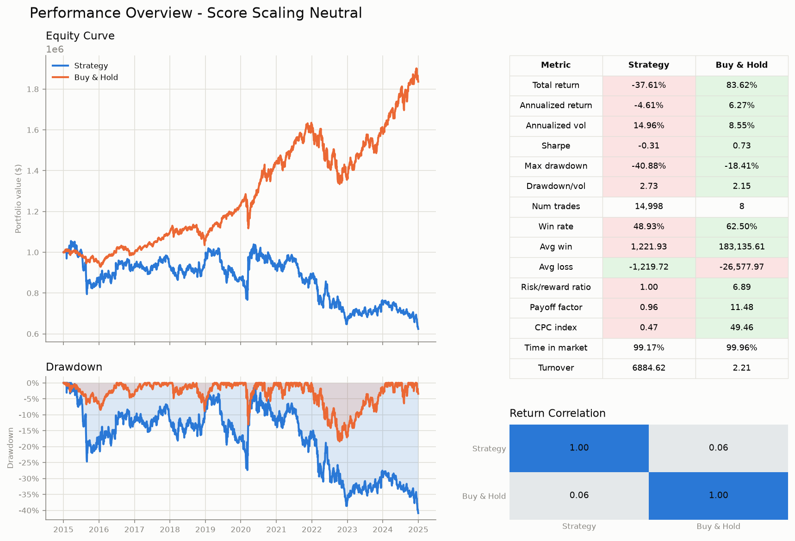

# backtester

Event-driven backtesting engine for equity strategies.

[](https://github.com/KaitoFuss/backtester/actions/workflows/ci.yml)


[](LICENSE)

## What is this

A single-threaded, deterministic backtesting engine built around a small
event loop:

```
DataHandler → MarketEvent → Strategy → SignalEvent → Portfolio → OrderEvent → ExecutionHandler → FillEvent → Portfolio
```

Every component (`DataHandler`, `Strategy`, `Portfolio`, `ExecutionHandler`,
`RiskManager`, `Tracker`) is a structural `Protocol`, so new strategies or
portfolio-construction models plug in without touching the engine. It ships
with three portfolio-construction models (risk-sized band trading,
continuous conviction-weighted rebalancing, and a dumb equal-weight
benchmark), entry-referenced stop-loss/take-profit/max-holding risk checks,
cost-aware execution (per-fill half-spread and commission, plus a
rebalancing drift band to suppress churn), a cost sweep that reports the
breakeven half-spread, and a multi-page PDF performance report (equity
curve, drawdown, trade stats, monthly returns, return correlation, cost
sensitivity).

See [ARCHITECTURE.md](ARCHITECTURE.md) for the full design writeup.

## Sample output



A dollar-neutral z-score mean-reversion strategy vs. an equal-weight
buy-and-hold benchmark, both on the same 8-ETF universe, 2015–2025, charged
1.0 bp half-spread and 0.5 bp commission per fill. The strategy returns
**-37.6% at a Sharpe of -0.31** against the benchmark's +83.6% / 0.73.

With costs switched off it returns +74.9% at 0.38 — the whole result lives
inside the cost term. It rebalances every bar, turns over ~688x its equity a
year, and its Sharpe crosses zero at a **0.31 bp** half-spread on top of the
shipped commission. That fragility is the interesting output here, not the
return. See [`examples/reports/`](examples/reports/) for both committed
sample reports, the full cost curve, and how to regenerate them.

## Quickstart

```bash
uv sync
uv run scripts/fetch_data.py configs/fetch_data.json
uv run scripts/run_zscore_backtest.py configs/zscore_rebalanced_neutral.json -v --cost-sweep
```

No dataset is committed — the first command pulls the sample 8-ETF universe
(2015–2025 daily bars) from yfinance into `data/raw`. The second runs the
strategy and writes a PDF report to `output/zscore_ma/`; `-v` prints the
trade blotter as it goes (`-vv` adds the full numeric trail), and
`--cost-sweep` re-runs the config across a ladder of trading costs and folds
a Sharpe-vs-cost page with the breakeven half-spread into the report. Swap
in `configs/zscore_backtest.json` for the risk-sized band-trading variant.

## Project structure

```
src/backtester/   # library source (src layout)
tests/            # tests, mirroring src/backtester/ module paths
scripts/          # CLI entry points (data fetch, run a backtest)
configs/          # backtest/data-fetch configs consumed by scripts/
examples/reports/ # committed sample reports (see its own README)
pyproject.toml    # project metadata, dependencies, and tool config
                   # (ruff, mypy, pytest, coverage all configured here)
```

## Development

```bash
uv sync                      # install/sync deps
uv run ruff format .         # format
uv run ruff check . --fix    # lint
uv run mypy .                # strict type check
uv run pytest                # tests (coverage gate: --cov-fail-under=95)
```

Optionally, install the pre-commit hooks so formatting/linting run
automatically on `git commit`:

```bash
uv run --with pre-commit pre-commit install
```

## Conventions

- `mypy --strict` across `src` and `tests`.
- Ruff for lint + format; rule set and config live in `pyproject.toml`.
- Structural typing via `Protocol` over inheritance/ABCs for every
  pluggable component (see `core/engine.py`).
- Tests mirror `src/backtester/` module paths 1:1 under `tests/`.
- Dependencies are added via `uv add` / `uv add --dev`, never by hand-editing
  `pyproject.toml`.

## License

MIT — see [LICENSE](LICENSE).
